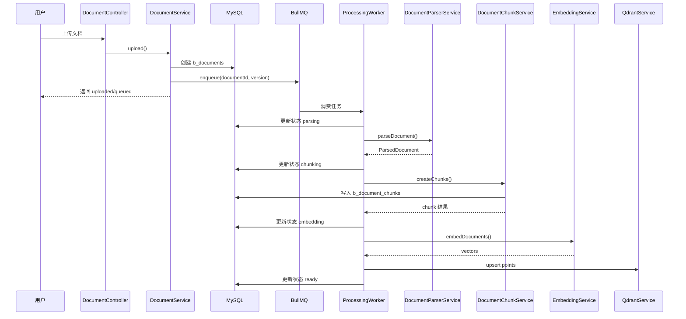
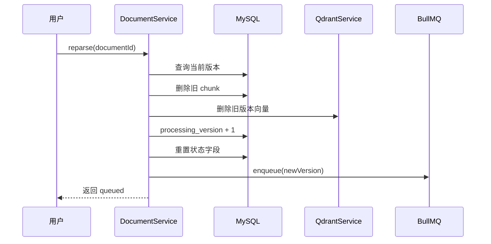

# RAG 文档异步处理详细设计

## 1. 文档说明

- 本文档承接《[09-rag-document-processing-architecture-plan-2026-04-25.md](file:///d:/Faith/Project/rag-knowledge-base/docs/09-rag-document-processing-architecture-plan-2026-04-25.md)》中的总体方案，进一步细化为可直接进入开发阶段的详细设计稿。
- 本文档重点回答“具体怎么落地”，包括模块拆分、类职责、BullMQ Job 设计、Prisma 字段调整建议、关键时序图、实施清单与验收标准。
- 本文档默认采用以下已确认方案：
  - Embedding 首版采用阿里云百炼平台向量模型
  - 首版解析格式限定为 `pdf / docx / md / txt`
  - Qdrant 采用“单集合 + payload 过滤”设计
  - 重解析采用 `processing_version` 版本化设计
  - 首版继续使用本地文件存储

相关文档：

- [09-rag-document-processing-architecture-plan-2026-04-25.md](file:///d:/Faith/Project/rag-knowledge-base/docs/09-rag-document-processing-architecture-plan-2026-04-25.md)
- [03-database-design.md](file:///d:/Faith/Project/rag-knowledge-base/docs/03-database-design.md)
- [05-backend_infra_implementation.md](file:///d:/Faith/Project/rag-knowledge-base/docs/05-backend_infra_implementation.md)
- [document-module-development-progress-2026-04-24.md](file:///d:/Faith/Project/rag-knowledge-base/apps/backend/docs/document-module-development-progress-2026-04-24.md)
- [document-upload-implementation-record-2026-04-24.md](file:///d:/Faith/Project/rag-knowledge-base/apps/backend/docs/document-upload-implementation-record-2026-04-24.md)
- [document-chunking-strategy-upgrade-plan-2026-04-25.md](file:///d:/Faith/Project/rag-knowledge-base/apps/backend/docs/document-chunking-strategy-upgrade-plan-2026-04-25.md)

## 2. 设计目标

本次详细设计目标如下：

1. 明确每个模块和类的职责边界
2. 明确文档处理全链路的任务模型
3. 明确数据库需要补充的字段与用途
4. 明确 BullMQ 队列、Job、幂等、重试和限频策略
5. 明确首版实施顺序，避免一次性做过多复杂能力

## 3. 总体落地策略

### 3.1 首版不追求一步到位

首版落地采用“单队列主链路 + 阶段化服务拆分”的策略。

即：

- 队列层先只接一个主队列 `document-processing`
- 代码层仍拆成解析、分片、向量化、索引四个阶段服务
- 后续如果吞吐量增加，再自然演进为多队列方案

这样做的原因：

- 实现复杂度更低
- 更容易先跑通最小闭环
- 不影响后续升级为多队列

### 3.2 首版技术重点

首版优先保证以下能力正确：

- 上传后真正入队
- 异步状态流转正确
- 解析结果能落 chunk
- 向量能写入 Qdrant
- 重解析不会被旧任务污染
- 百炼限频不会把 Worker 打崩

## 4. 模块拆分设计

### 4.1 模块目录建议

```text
apps/backend/src/
  common/
    vector/
      qdrant.module.ts
      qdrant.service.ts
      qdrant.constants.ts
  modules/
    ai/
      ai.module.ts
      embedding.service.ts
      providers/
        embedding-provider.interface.ts
        bailian-embedding.provider.ts
    document/
      document.module.ts
      document.service.ts
      document.controller.ts
    document-processing/
      document-processing.module.ts
      constants/
        document-processing.constants.ts
      dto/
        enqueue-document-job.dto.ts
      interfaces/
        parsed-document.interface.ts
        parsed-section.interface.ts
        document-processing-job.interface.ts
      queue/
        document-queue.service.ts
      processor/
        document-processing.processor.ts
      services/
        document-processing.service.ts
        document-parser.service.ts
        document-chunk.service.ts
        document-processing-state.service.ts
        document-processing-task.service.ts
```

### 4.2 模块职责

#### `DocumentModule`

职责：

- 管理文档 HTTP 接口
- 管理文档元数据
- 上传成功后触发入队
- 删除和重解析时发起清理与重新处理

不负责：

- 文本解析
- chunk 生成
- embedding 调用
- Qdrant 写入

#### `DocumentProcessingModule`

职责：

- 管理异步处理主链路
- 消费队列任务
- 编排解析、分片、向量化、索引阶段
- 维护文档处理状态
- 维护幂等与任务日志

#### `AiModule`

职责：

- 抽象 Embedding 模型能力
- 处理第三方模型调用细节
- 对百炼做限频、批量、超时、重试控制

#### `VectorModule`

职责：

- 抽象 Qdrant 读写能力
- 管理 collection 初始化
- 统一构造 payload
- 统一删除与检索过滤逻辑

## 5. 类职责设计

### 5.1 `DocumentQueueService`

建议职责：

- 封装 BullMQ 队列实例
- 提供 `enqueueDocumentProcessing()` 方法
- 统一生成 `jobId`
- 统一配置任务选项

建议方法：

```ts
enqueueDocumentProcessing(payload: DocumentProcessingJobPayload): Promise<void>
buildJobId(documentId: string, processingVersion: number): string
```

### 5.2 `DocumentProcessingProcessor`

建议职责：

- 作为 BullMQ 消费入口
- 串联四个阶段服务
- 捕获错误并统一回写失败状态
- 记录任务开始、完成、失败日志

建议方法：

```ts
process(job: Job<DocumentProcessingJobPayload>): Promise<void>
```

### 5.3 `DocumentProcessingService`

建议职责：

- 编排文档处理主流程
- 负责单文档一次完整处理
- 内部串行调用：
  - `parseDocument()`
  - `createChunks()`
  - `embedChunks()`
  - `indexChunks()`

建议方法：

```ts
processDocument(payload: DocumentProcessingJobPayload): Promise<void>
```

### 5.4 `DocumentParserService`

建议职责：

- 根据文件类型调用不同解析策略
- 输出统一 `ParsedDocument`

建议方法：

```ts
parseDocument(filePath: string, fileType: string): Promise<ParsedDocument>
parsePdf(filePath: string): Promise<ParsedDocument>
parseDocx(filePath: string): Promise<ParsedDocument>
parseMarkdown(filePath: string): Promise<ParsedDocument>
parseText(filePath: string): Promise<ParsedDocument>
```

### 5.5 `DocumentChunkService`

建议职责：

- 对解析结果进行结构化切块
- 计算 chunk token
- 写入 `b_document_chunks`
- 在结构信息缺失时回退到全文递归切块

建议方法：

```ts
createChunks(documentId: bigint, parsed: ParsedDocument, version: number): Promise<CreatedChunkResult>
createStructuredChunks(parsed: ParsedDocument): Promise<StructuredChunkDraft[]>
splitOversizedSection(section: ParsedSection): Promise<StructuredChunkDraft[]>
```

### 5.6 `EmbeddingService`

建议职责：

- 统一 Embedding 接口
- 处理百炼 API 调用
- 实现批量调用、限频、超时、重试

建议方法：

```ts
embedDocuments(texts: string[]): Promise<number[][]>
```

### 5.7 `QdrantService`

建议职责：

- 初始化 collection
- upsert 向量点
- 按 `docId` 或旧版本删除向量
- 按过滤条件执行搜索

建议方法：

```ts
ensureCollection(): Promise<void>
upsertChunkVectors(points: QdrantPointPayload[]): Promise<void>
deleteByDocument(documentId: string): Promise<void>
deleteByDocumentVersion(documentId: string, version: number): Promise<void>
searchByKnowledgeBase(kbId: string, vector: number[], topK: number): Promise<SearchResult[]>
```

### 5.8 `DocumentProcessingStateService`

建议职责：

- 统一回写文档状态
- 避免状态变更逻辑散落在各阶段服务里

建议方法：

```ts
markQueued(documentId: bigint, version: number): Promise<void>
markParsing(documentId: bigint, version: number): Promise<void>
markChunking(documentId: bigint, version: number): Promise<void>
markEmbedding(documentId: bigint, version: number): Promise<void>
markReady(documentId: bigint, version: number, result: ReadyResult): Promise<void>
markFailed(documentId: bigint, version: number, error: ProcessingErrorInfo): Promise<void>
```

### 5.9 `DocumentProcessingTaskService`

建议职责：

- 如果新增任务表，则负责任务表记录
- 如果首版不新增任务表，也可先写基础日志封装

建议方法：

```ts
startTask(payload: DocumentProcessingJobPayload): Promise<void>
completeTask(payload: DocumentProcessingJobPayload): Promise<void>
failTask(payload: DocumentProcessingJobPayload, error: ProcessingErrorInfo): Promise<void>
```

## 6. 接口与数据流转设计

### 6.1 上传后的链路

上传成功后，`DocumentService.upload()` 只做三件事：

1. 保存文件
2. 创建 `b_documents`
3. 调用 `DocumentQueueService.enqueueDocumentProcessing()`

不在同步请求中做以下操作：

- 解析文件
- 生成 chunk
- 调用 embedding
- 写入 Qdrant

### 6.2 重解析链路

`DocumentService.reparse()` 建议按以下顺序处理：

1. 校验权限
2. 查询文档当前状态与版本
3. 删除旧 chunk
4. 删除旧向量
5. `processing_version + 1`
6. 重置文档状态、错误信息、统计字段
7. 重新入队

### 6.3 删除文档链路

`DocumentService.remove()` 建议后续补齐以下动作：

1. 删除数据库文档记录
2. 删除本地文件
3. 删除关联 chunk
4. 删除 Qdrant 中该文档向量

说明：

- 当前代码已经处理本地文件删除和数据库删除
- 后续需要补充 Qdrant 删除逻辑

## 6.4 当前实际分片现状

当前工程已经落地的分片实现为：

- 直接读取 `ParsedDocument.plainText`
- 使用 LangChain `RecursiveCharacterTextSplitter`
- 以字符级 `chunkSize / chunkOverlap` 进行全文递归切分
- 再通过字符区间回推 `pageNo` 和 `section`

这套方案适合作为首版最小闭环，但存在以下局限：

- 未优先利用标题、段落、列表等结构边界
- 分片尺寸按字符控制，不够贴近 embedding 的 token 预算
- `pageNo` 和 `titlePath` 属于切分后的补偿推断，稳定性有限

因此，后续详细设计以“结构感知 + token 控制”的升级方案为准。

## 7. BullMQ 详细设计

### 7.1 队列名称

首版建议：

```text
document-processing
```

后续扩展版可拆为：

- `document-parse`
- `document-chunk`
- `document-embed`
- `document-index`

### 7.2 Job 数据结构

建议定义如下：

```ts
export interface DocumentProcessingJobPayload {
  documentId: string;
  kbId: string;
  processingVersion: number;
  triggerType: 'upload' | 'reparse';
  requestedBy: string;
  requestedAt: string;
}
```

### 7.3 Job ID 设计

建议格式：

```text
doc:{documentId}:v:{processingVersion}
```

例如：

```text
doc:10001:v:2
```

### 7.4 Job 配置建议

建议：

- `attempts: 3`
- `removeOnComplete: 1000`
- `removeOnFail: 1000`
- `backoff: exponential`

并增加以下保护：

- 单文档同版本只允许一个 job
- 同版本重复点击重解析时直接忽略重复入队

### 7.5 Worker 并发建议

首版建议 Worker 并发控制较低，例如：

- `concurrency = 1` 或 `2`

原因：

- 解析和 embedding 都是重资源任务
- 百炼有频率限制
- 当前阶段优先稳定而不是追求吞吐

## 8. 百炼 Embedding 接入设计

### 8.1 首版适配策略

由于百炼平台存在频率限制，Embedding 层必须做保护。

首版建议策略：

1. Worker 并发低值控制
2. 单批次文本数量限制
3. 同一时间只允许少量 embedding 请求在途
4. 对限流错误做延迟重试
5. 对非限流错误做分类处理

### 8.2 批量策略

建议参数：

- 每批文本数：`10 - 30`
- 单文本长度：进入 embedding 前先做截断保护
- 批次间加轻量延迟或应用层节流

### 8.3 重试策略

建议对以下异常启用重试：

- 429 限流
- 网络超时
- 5xx 平台异常

不建议重试：

- 参数错误
- 鉴权失败
- 模型配置缺失

### 8.4 异常包装建议

建议统一包装为业务异常，并补充上下文：

- `module: 'EmbeddingService'`
- `provider: 'bailian'`
- `action: 'embedDocuments'`
- `batchSize`
- `documentId`

## 9. Prisma 数据结构调整建议

### 9.1 `b_documents` 字段调整

建议补充以下字段：

| 字段名 | 类型 | 默认值 | 说明 |
| --- | --- | --- | --- |
| `processing_version` | Int | `1` | 文档处理版本号，用于重解析隔离 |
| `current_stage` | String | `"uploaded"` | 当前处理阶段 |
| `last_error_stage` | String? | `null` | 最近一次失败阶段 |
| `retry_count` | Int | `0` | 当前版本任务重试次数 |
| `last_error_code` | String? | `null` | 最近一次失败错误码 |

说明：

- `status` 面向前端展示
- `current_stage` 面向内部治理
- 如果你希望首版简化，也可以先让 `status` 与 `current_stage` 保持同值

### 9.2 `b_document_chunks` 字段使用要求

现有字段后续必须真正落地使用：

| 字段名 | 用途 |
| --- | --- |
| `page_no` | 回答引用页码 |
| `char_start` | 前端高亮定位 |
| `char_end` | 前端高亮定位 |
| `vector_id` | 关系库与向量库映射 |
| `metadata_json` | 存放标题路径、扩展元数据 |
| `embedding_status` | 标识该 chunk 是否已完成向量化 |

### 9.3 可选新增任务表

建议可选新增：

```text
b_document_processing_tasks
```

建议字段：

| 字段名 | 说明 |
| --- | --- |
| `id` | 主键 |
| `document_id` | 文档 ID |
| `processing_version` | 文档处理版本 |
| `job_id` | BullMQ Job ID |
| `stage` | 当前阶段 |
| `status` | `running / completed / failed` |
| `attempt` | 当前尝试次数 |
| `error_message` | 错误信息 |
| `started_at` | 开始时间 |
| `finished_at` | 结束时间 |

## 10. Qdrant 详细设计

### 10.1 Collection 设计

统一采用单集合：

```text
kb_document_chunks
```

### 10.2 向量点结构

建议 point 结构如下：

```ts
type ChunkPoint = {
  id: string;
  vector: number[];
  payload: {
    kbId: string;
    docId: string;
    chunkId: string;
    chunkIndex: number;
    uploaderId?: string;
    processingVersion: number;
    visibility?: string;
    isPublic?: boolean;
    pageNo?: number;
    title?: string;
    titlePath?: string[];
    charStart?: number;
    charEnd?: number;
  };
};
```

### 10.3 `id` 建议

建议使用稳定、可追踪的 `vector id`：

```text
doc:{docId}:chunk:{chunkId}:v:{processingVersion}
```

### 10.4 删除策略

删除场景建议如下：

- 删除文档：
  - 按 `docId` 删除全部向量
- 重解析：
  - 先按 `docId + processingVersion(old)` 删除旧版本
- 回滚补偿：
  - 如果数据库已删但 Qdrant 删除失败，记录补偿任务

### 10.5 检索过滤策略

单知识库检索：

```json
{
  "must": [
    { "key": "kbId", "match": { "value": "1001" } }
  ]
}
```

多知识库联合检索：

```json
{
  "should": [
    { "key": "kbId", "match": { "value": "1001" } },
    { "key": "kbId", "match": { "value": "1002" } }
  ]
}
```

说明：

- 具体 Qdrant 查询体可在编码时再按 SDK 结构落地
- 这里的重点是明确检索必须依赖 payload filter 实现隔离

## 11. 统一接口结构设计

### 11.1 `ParsedDocument`

```ts
export interface ParsedDocument {
  plainText: string;
  sections: ParsedSection[];
  pageMap?: Array<{
    pageNo: number;
    text: string;
    charStart: number;
    charEnd: number;
  }>;
  metadata?: Record<string, unknown>;
}
```

### 11.2 `ParsedSection`

```ts
export interface ParsedSection {
  title?: string;
  level?: number;
  content: string;
  pageNo?: number;
  charStart?: number;
  charEnd?: number;
}
```

### 11.3 `CreatedChunkResult`

```ts
export interface CreatedChunkResult {
  chunkIds: string[];
  totalChunks: number;
  totalTokens: number;
}
```

建议后续补充中间结构：

```ts
export interface StructuredChunkDraft {
  content: string;
  pageNo?: number;
  charStart?: number;
  charEnd?: number;
  titlePath: string[];
  sectionLevel?: number;
  chunkStrategy: 'structured-token-aware' | 'plainText-recursive';
}
```

### 11.4 `ProcessingErrorInfo`

```ts
export interface ProcessingErrorInfo {
  code: string;
  stage: string;
  message: string;
  causeMessage?: string;
}
```

## 12. 状态流转详细设计

### 12.1 标准状态流转

```text
uploaded
  -> queued
  -> parsing
  -> chunking
  -> embedding
  -> ready

任意阶段异常 -> failed
```

### 12.2 回写时机

- 上传完成并成功入队：
  - `status = queued`
- 进入解析阶段：
  - `status = parsing`
  - `parse_started_at = now()`
- 开始切块：
  - `status = chunking`
- 开始 embedding：
  - `status = embedding`
- 完成全部处理：
  - `status = ready`
  - `parse_finished_at = now()`
- 失败：
  - `status = failed`
  - `last_error_stage = stage`
  - `error_msg = message`
  - `retry_count = attempt`

## 12.3 分片阶段内部状态说明

虽然对外文档状态统一只展示 `chunking`，但在实现上建议把分片阶段拆成两个内部步骤：

1. 结构粗切
2. token 二次切分

说明：

- 这两个步骤当前无需单独暴露新的文档状态
- 但建议在任务日志或 `metadata_json` 中保留策略标识
- 这样既不增加前端复杂度，也便于后续问题排查和效果评估

## 13. 幂等与版本化设计

### 13.1 为什么必须做版本化

如果不做 `processing_version`，会出现以下问题：

- 用户重解析时旧任务仍在继续执行
- 旧任务可能把旧 chunk 或旧向量覆盖到新结果上
- 无法区分当前文档结果属于哪一轮处理

### 13.2 版本校验规则

在 Worker 每个关键阶段开始前，都应校验：

1. 当前数据库中的 `processing_version`
2. 当前 Job 中的 `processing_version`

如果不一致，立即终止当前 Job，不再继续处理。

### 13.3 幂等规则

建议如下：

- 同文档同版本只允许一个 Job
- 同阶段重复执行前，先检查目标数据是否已存在
- 重解析时先清理旧版本数据再重新写入
- Qdrant upsert 使用稳定 `vector_id`

## 14. 关键时序图

### 14.1 上传到可检索时序



### 14.2 重解析时序



## 15. 首版开发任务拆分

### 15.1 第一批任务

目标：先打通最小闭环。

- [ ] Prisma 增加 `processing_version` 等字段
- [ ] 新增 `document-processing` 模块骨架
- [ ] 接入 Redis + BullMQ
- [ ] 新增 `DocumentQueueService`
- [ ] 修改 `DocumentService.upload()` 接入入队
- [ ] 修改 `DocumentService.reparse()` 接入版本化重解析

### 15.2 第二批任务

目标：接入真实解析与分片。

- [ ] 实现 `DocumentParserService`
- [ ] 实现 `DocumentChunkService`
- [ ] 将 chunk 写入 `b_document_chunks`
- [ ] 回写文档 token 统计
- [ ] 完成状态从 `parsing -> chunking`

已落地情况补充：

- 当前第二阶段已经实现“全文 `plainText` + `RecursiveCharacterTextSplitter`”的字符级递归切分
- 该方案可用，但建议继续升级为“结构感知 + token 二次切分”

建议追加升级任务：

- [ ] `md` 优先接入标题感知切分
- [ ] `pdf / docx / txt` 优先基于 `sections` 做结构粗切
- [ ] 过长结构块改为 token 窗口二次切分
- [ ] 在 `metadata_json` 中记录 `chunkStrategy`

### 15.3 第三批任务

目标：接入 Embedding 与 Qdrant。

- [ ] 新增 `AiModule`
- [ ] 接入百炼向量模型
- [ ] 完成限频、批量、重试控制
- [ ] 新增 `QdrantService`
- [ ] 完成向量写入与删除

### 15.4 第四批任务

目标：增强治理能力。

- [ ] 增加任务日志
- [ ] 增加失败重试统计
- [ ] 增加超时任务扫描
- [ ] 增加补偿删除机制
- [ ] 增加管理端进度信息输出

## 16. 每阶段验收标准

### 16.1 队列接入验收

- 上传成功后数据库状态变为 `queued`
- Worker 能消费任务
- 同文档同版本不重复消费

### 16.2 解析验收

- `pdf / docx / md / txt` 可成功解析
- 失败时能记录明确错误
- PDF 能保留基本页码信息

### 16.3 分片验收

- chunk 成功落库
- `chunk_index` 连续正确
- `metadata_json` 包含溯源信息
- `titlePath` 与 `pageNo` 优先来自结构块而不是切分后补偿推断
- chunk 大小控制以 token 预算为主，而不是仅按字符数

### 16.4 向量化验收

- 百炼调用稳定
- 出现限流时能自动退避重试
- 向量维度与 collection 配置一致

### 16.5 Qdrant 验收

- 向量可成功 upsert
- 删除文档时向量同步删除
- 重解析不会残留旧版本向量

## 17. 风险点与规避建议

### 17.1 百炼限流风险

规避方案：

- 控制 Worker 并发
- 控制批大小
- 对 429 做延迟重试
- 日志单独区分限流错误

### 17.2 文档格式兼容风险

规避方案：

- 首版仅支持 4 种格式
- 每种格式独立解析器
- 空文档和损坏文档明确失败

### 17.5 分片质量退化风险

规避方案：

- 保留当前 `RecursiveCharacterTextSplitter` 作为兜底方案
- 在结构信息完整时优先走“结构感知 + token 二次切分”
- 在 `metadata_json` 中记录分片策略，便于后续回放与效果评估
- 通过真实问答样本持续评估召回命中质量

### 17.3 重解析污染风险

规避方案：

- 强制 `processing_version`
- 每阶段校验版本号
- 使用稳定 `jobId`

### 17.4 向量残留风险

规避方案：

- 删除逻辑统一收口到 `QdrantService`
- 重解析前优先清理旧版本
- 删除失败记录补偿任务

## 18. 结论

这份详细设计的核心结论如下：

- 首版采用“单主队列 + 阶段化服务”实现方式
- `document` 只负责业务入口，`document-processing` 负责异步编排
- 百炼向量模型接入必须内建限频、批量、重试控制
- Qdrant 采用单集合和 payload 过滤实现多知识库隔离
- `processing_version` 是整个重解析和幂等设计的核心
- 分片策略应从当前字符级递归切分逐步升级为“结构感知 + token 控制”的主流方案

按本设计推进后，项目可以较稳地完成：

- 上传后异步解析
- 分片落库
- 向量化
- 入向量库
- 重解析治理

这将成为后续知识库检索和问答模块的稳定基础。
